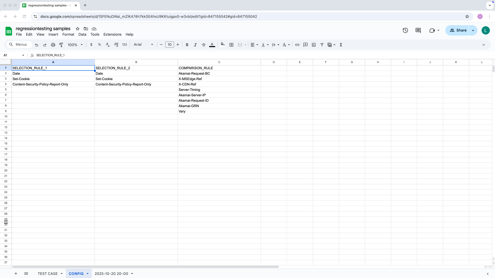

# RegressionTesting
**Copyright (c) 2025 Lionel Guo**  
**Author:** Lionel Guo  
**Email:** [lionelliguo@gmail.com](mailto:lionelliguo@gmail.com)  
**GitHub:** [https://github.com/lionelliguo/regressiontesting](https://github.com/lionelliguo/regressiontesting)

---

## 🧩 Overview
`RegressionTesting` is a Python package for Automated Regression Testing with Google Sheets. This package allows you to:

- Fetch and compare HTTP Status Line and Header Fields using `curl` commands stored in Google Sheets.  
- Process these commands and store results (PASS/FAIL) back to Google Sheets.  
- Automatically manage the testing process using batch updates and configurable settings.

### Google Sheet Structure

#### 1. **TEST CASE Sheet (`TEST CASE`)**

The **TEST CASE** sheet is used for storing the test scripts and their results. It contains the following columns:

- **CURL_1**: Stores the first `curl` scripts for execution.
- **RESULT_1**: Stores the HTTP Status Line and Header Fields returned by the first `curl` script. The HTTP Status Line and Header Fields listed in `SELECTION_RULE_1` will not appear in `RESULT_1`.
- **CURL_2**: Stores the second `curl` scripts for execution.
- **RESULT_2**: Stores the HTTP Status Line and Header Fields returned by the second `curl` script. The HTTP Status Line and Header Fields listed in `SELECTION_RULE_2` will not appear in `RESULT_2`.
- **STATUS**: Stores the comparison results between `RESULT_1` and `RESULT_2`. If the results match, it will be PASS, otherwise, it will be FAIL. The HTTP Status Line and Header Fields listed in `COMPARISON_RULE` will be excluded when checking if the results match.

Example:

| CURL_1                      | RESULT_1 | CURL_2                      | RESULT_2 | STATUS |
|-----------------------------|----------|-----------------------------|----------|--------|
| `curl https://example1.com` |          | `curl https://example2.com` |          |        |
| `curl https://example3.com` |          | `curl https://example4.com` |          |        |

#### 2. **Config Sheet (`CONFIG`)**

The **CONFIG** sheet defines selection and comparison rules for the HTTP Status Line and Header Fields. It contains the following columns:

- **SELECTION_RULE_1**: Fields to ignore for the first curl result.
- **SELECTION_RULE_2**: Fields to ignore for the second curl result.
- **COMPARISON_RULE**: Fields ignored during comparison.

Example:

| SELECTION_RULE_1 | SELECTION_RULE_2 | COMPARISON_RULE |
|------------------|------------------|-----------------|
| Content-Length   | Content-Length   | Date            |
| Content-Type     | Content-Type     | Server          |

#### 3. **Automatic Creation of a New Sheet**

Each regression run creates a new sheet (timestamped).  
This sheet contains the same test structure and logs all outputs for documentation.

---

## ⚙️ Requirements
- Python 3.x  
- Required packages:
  ```bash
  pip3 install gspread google-auth google-auth-oauthlib regressiontesting
  ```
- `curl` command-line tool  
- A valid Google Service Account JSON key

---

## 🚀 Setup
```bash
git clone https://github.com/lionelliguo/regressiontesting.git
cd regressiontesting
pip3 install -r requirements.txt
```

---

## 🛠️ Configuration (`settings.json`)
```json
{
  "SPREADSHEET_URL": "Your Google Spreadsheets URL",
  "SERVICE_ACCOUNT_FILE": "Your Google Service Account Key.json",
  "SLEEP_SECONDS": 1.0,
  "IGNORE_CASE": true,
  "COPY_BATCH_SIZE": 0,
  "OUTPUT_BATCH_SIZE": 0
}
```
> `0` means “all in one batch”.

---

## ▶️ Example Usage
```bash
python3 main.py
```

---

## ⚡ Quick Start
Use `settings-sample.json` for instant testing.  
Result Sheet: [Google Sheet Link](https://docs.google.com/spreadsheets/d/1SFENuDWai_mZIKA7h7kkGE4hsU9KKtuigpx0-w3vbI/)

---

## 📸 Snapshots

### 🧪 TEST CASE
Example test cases setup in Google Sheets:  


---

### ⚙️ CONFIG
Configuration rules for header selection and comparison:  


---

### 📊 RESULT
Regression test results with color-coded PASS/FAIL visualization:  


---

## 📄 License
Licensed under the **Apache License, Version 2.0**.  
See [LICENSE](https://www.apache.org/licenses/LICENSE-2.0) for details.
